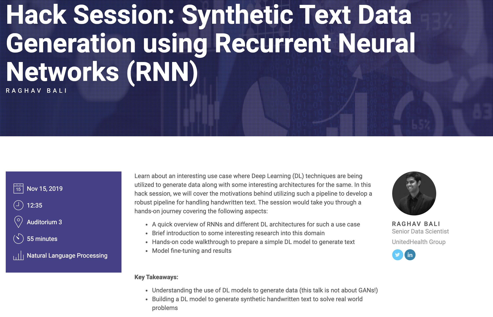

# Synthetic Text Data Generation using Recurrent Neural Networks
Hack Session @ DataHack Summit 2019

---

### Agenda:
+ Why Generate handwriting
+ Overall Setup
+ IAM Handwriting Dataset
+ Data Preparation
+ Model Description
+ Attention
+ Experiements

---
### References:
+ [Generating Sequences with RNNs, Alex Graves](https://arxiv.org/pdf/1308.0850.pdf)
+ [Neural Machine Translation by Jointly Learning to Align and Translate, Bengio et al](https://arxiv.org/abs/1409.0473)
+ [Attention Is All You Need, Vaswani et al](https://arxiv.org/abs/1706.03762)
+ [Handwriting Generation Demo](http://www.cs.toronto.edu/~graves/handwriting.cgi?)
+ [Chapter3, Hands on Transfer Learning, Dipanjan Sarkar, Raghav Bali, et al](https://subscription.packtpub.com/book/big_data_and_business_intelligence/9781788831307/3/ch03lvl1sec25/various-architectures)
+ [LSTM, Chris' blog](http://colah.github.io/posts/2015-08-Understanding-LSTMs/)
+ [Four Experiments in Handwriting with a Neural Network, distlill.pub](https://distill.pub/2016/handwriting/)
+ [Mixture Density Networks, Hardmaru/Otoro's Blog](http://blog.otoro.net/2015/11/24/mixture-density-networks-with-tensorflow/)
+ [Keras MDN](https://github.com/cpmpercussion/keras-mdn-layer)
+ [Tensorflow Probability](https://www.tensorflow.org/probability)
